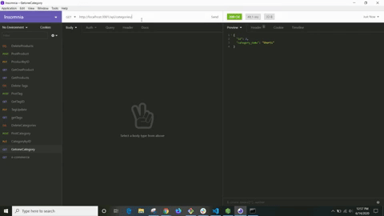
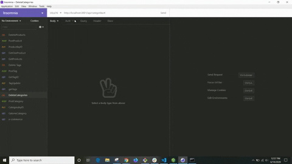
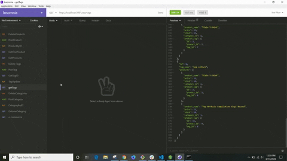

<h1 align="center">E-Commerce Back End</h1>

  

## Description
### MySql database that uses Expres, Sequelize, dotenv, and Node.js to run the backend of a E-Commerce site.

## Install
npm init

npm install mysql2

npm install sequelize

npm install dotenv

## Usage
### In the terminal Run follow these steps to start application
mysql -u root -p
enter password  

source db/schema.sql  
quit   

npm run seed  

npm start
      

### Link to demostration of the application 
[Demo of application](https://youtu.be/WbtVA5TOF1o) 
  

### Tests of different GET, PUSH, PUT, and DELETE requests.

  

 
   

## Questions
### [andytheelf for GitHub](https://github.com/andytheelf?tab=repositories)  